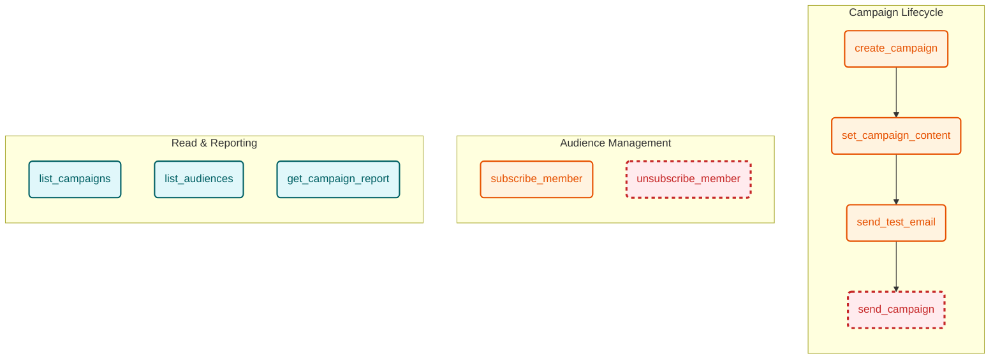

# Mailchimp MCP Server

An MCP server for integrating Mailchimp with AI agents.

## Prerequisites

- [Bun](https://bun.sh/) (JavaScript runtime)
- A Mailchimp account and an API Key.

## Tool Flow



> **Legend**:
>
> - **Blue/Solid**: Read-only actions
> - **Orange/Solid**: Write actions
> - **Red/Dashed**: High-risk write actions requiring `confirm: true`

## Tools

### 1. `create_campaign`
Creates a new Mailchimp campaign. It sets up the campaign's type, audience (list_id), and settings (subject line, from name, reply-to).
- **Example Input:** 
  ```json
  { 
    "type": "regular",
    "list_id": "aud123456",
    "subject_line": "Monthly Newsletter",
    "from_name": "Acme Corp",
    "reply_to": "newsletter@acmecorp.com"
  }
  ```
- **Example Output:** A JSON string containing the new campaign's ID and status.

### 2. `send_test_email`
Sends a test email for a Mailchimp campaign. The campaign must have content set before sending a test.
- **Example Input:** 
  ```json
  { 
    "campaign_id": "camp_123456",
    "test_emails": ["tester1@example.com", "tester2@example.com"],
    "send_type": "html"
  }
  ```
- **Example Output:** A simple confirmation text indicating success.

### 3. `set_campaign_content`
Sets the HTML content for a Mailchimp campaign. Mailchimp will automatically generate a plain-text version if not provided.
- **Example Input:** 
  ```json
  { 
    "campaign_id": "camp_123456",
    "html": "<html><body><h1>Hello, World!</h1></body></html>"
  }
  ```
- **Example Output:** A confirmation text including the campaign ID and the length of the content set.

### 4. `send_campaign`
Sends a Mailchimp campaign to its audience.
- **Safety Gate:** This tool requires a `confirm` flag set to `true`. If omitted or set to `false`, it performs a dry-run and will not send the campaign.
- **Example Input:** 
  ```json
  { 
    "campaign_id": "camp_123456",
    "confirm": true
  }
  ```
- **Example Output:** A success message confirming the campaign was sent, or an error if it was already sent.

### 5. `list_campaigns`
Lists Mailchimp campaigns with pagination.
- **Example Input:** 
  ```json
  { 
    "count": 10,
    "offset": 0
  }
  ```
- **Example Output:** A JSON string containing an array of campaigns and the total item count.

### 6. `list_audiences`
Lists Mailchimp audiences (lists) with pagination.
- **Example Input:** 
  ```json
  { 
    "count": 10,
    "offset": 0
  }
  ```
- **Example Output:** A JSON string containing an array of audiences and the total item count.

### 7. `get_campaign_report`
Retrieves performance stats (opens, clicks, bounces, etc.) for a sent Mailchimp campaign.
- **Example Input:** 
  ```json
  { 
    "campaign_id": "camp_123456"
  }
  ```
- **Example Output:** A JSON string containing the detailed report metrics.

### 8. `subscribe_member`
Subscribes a member to a Mailchimp audience (list), acting as an upsert (add or update).
- **Behavior:** By default, `status` is set to `"pending"`, which triggers Mailchimp's double opt-in email. You must explicitly pass `"status": "subscribed"` if you want to subscribe the member immediately without double opt-in.
- **Example Input:** 
  ```json
  { 
    "list_id": "aud123456",
    "email_address": "user@example.com",
    "status": "pending"
  }
  ```
- **Example Output:** A JSON string containing the member's ID, email address, and status.

### 9. `unsubscribe_member`
Unsubscribes a member from a Mailchimp audience (list).
- **Safety Gate:** This tool requires a `confirm` flag set to `true`. If omitted or set to `false`, it performs a dry-run and will not unsubscribe the member.
- **Example Input:** 
  ```json
  { 
    "list_id": "aud123456",
    "email_address": "user@example.com",
    "confirm": true
  }
  ```
- **Example Output:** A JSON string containing the member's ID, email address, and "unsubscribed" status.
